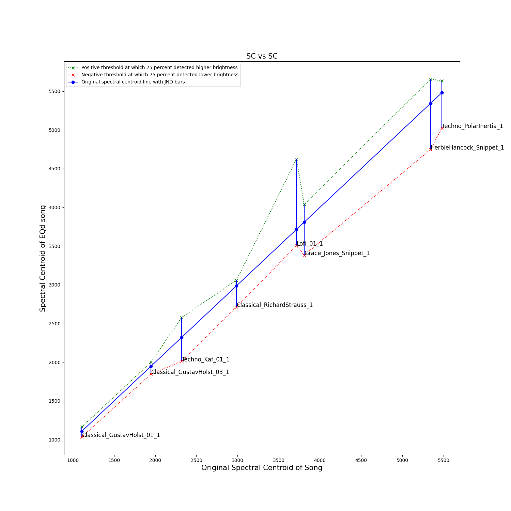
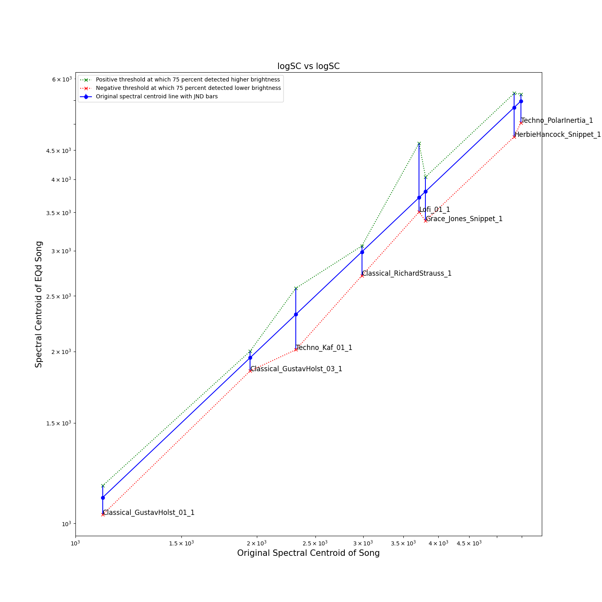

# Introduction

We present resources for our study on the Spectral Centroid and Brightness Perception in Complex Musical Signals. 

# Pre-processing

We did the following steps for Data Processing -

1. Selecting 5-10 Seconds with meaningful musical content
2. Initial Spectral Centroid (SC) Measurement
3. Adjusting Energy for Frequencies above and below SC
by values of:
[-4, -3, -2., -1., -0.75, -0.5, -0.25, 0.25, 0.5, 0.75, 1., 2., 3, 4] dB
4. Re-measuring Spectral Centroid
5. Calculate Spectral Centroid-Delta

The script can be found in the `preprocessing` folder.

# Procedure

We used the sounds from previous step to prepare a study -

1. Online listening test conducted via a dedicated web platform (WebMushra):
https://dhunstack.github.io/webMUSHRA/
2. Present participants with systematically altered musical signals from diverse genres
3. Reference track included in all slider sets for consistency checks
4. Ask participants to sort signals based on perceived brightness

**We provide generic Python wrappers for webMUSHRA pages, that could be used to generate any test configuration.**
We use these wrappers to generate our test configuration, that we provide as well.

# Evaluation

We provide the following -
1. Anonymised Dataset from the Study
2. Jupyter Notebook with all our computations

Following graphs show our JND findings for spectral centroid and brightness

# Results and Conclusion

We obtain the following results - 
1. High degree of correlation between spectral centroid delta and the brightness perception
2. A measure of JND for EQ and spectral centroids delta vs frequency (through song spectral centroids)

Our results demonstrate that spectral centroid is a good brightness proxy not only for monophonic sounds but also complete musical phrases.